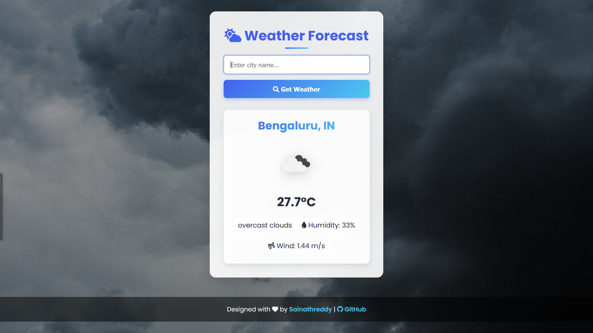

# 🌦️ Weather Forecast Application

### A beautiful, responsive weather application built with modern web technologies

## 📋 Features

- **Real-time Weather Data**: Get accurate weather information for any city worldwide
- **Geolocation Support**: Automatically fetch weather for your current location
- **Responsive Design**: Beautiful UI that works on all devices - mobile, tablet, and desktop
- **Modern UI**: Clean, intuitive interface with smooth animations and transitions
- **Detailed Information**: View temperature, weather conditions, humidity, and wind speed

## 🛠️ Technologies Used

- **HTML5**: Semantic markup for structure
- **CSS3**: Modern styling with flexbox, animations, and responsive design
- **JavaScript**: Dynamic content and API integration
- **OpenWeatherMap API**: Real-time weather data source
- **Font Awesome**: Beautiful icons for enhanced UI

## 🚀 Getting Started

1. Clone the repository
2. Open `index.html` in your browser
3. Allow location access for automatic weather detection or search for a city

## 📱 Responsive Design

The application is fully responsive and optimized for:
- Mobile devices
- Tablets
- Desktop computers

## 🔄 API Integration

This application uses the OpenWeatherMap API to fetch real-time weather data. The API provides:
- Current temperature
- Weather conditions
- Humidity levels
- Wind speed
- Location information

## 🔗 Connect with Me

---

  
Made with ❤️ by Sainathreddy

